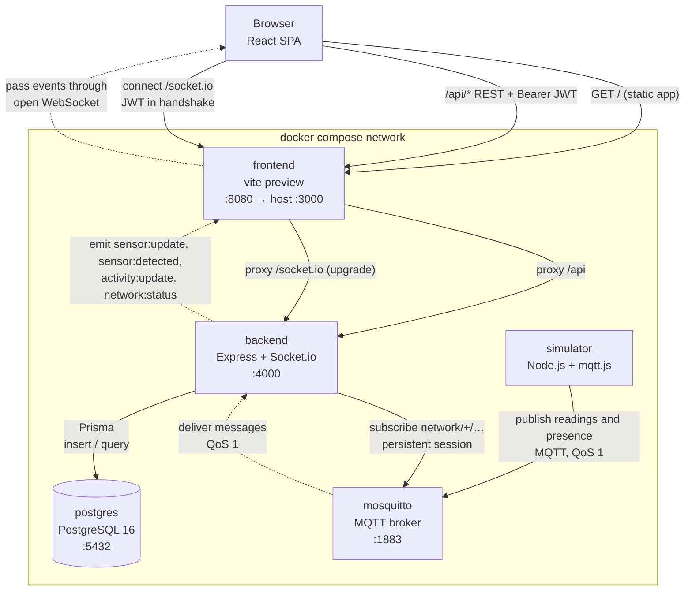
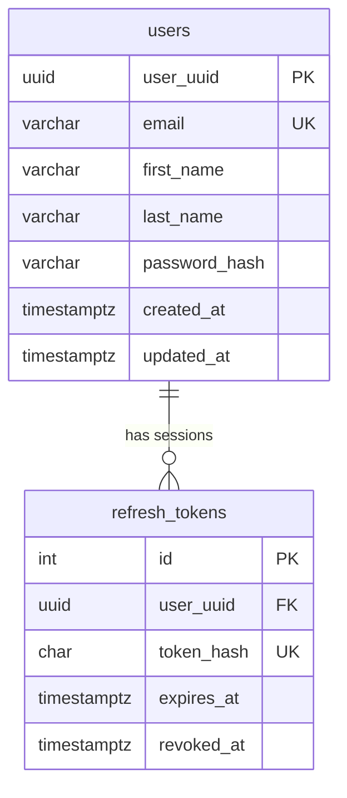
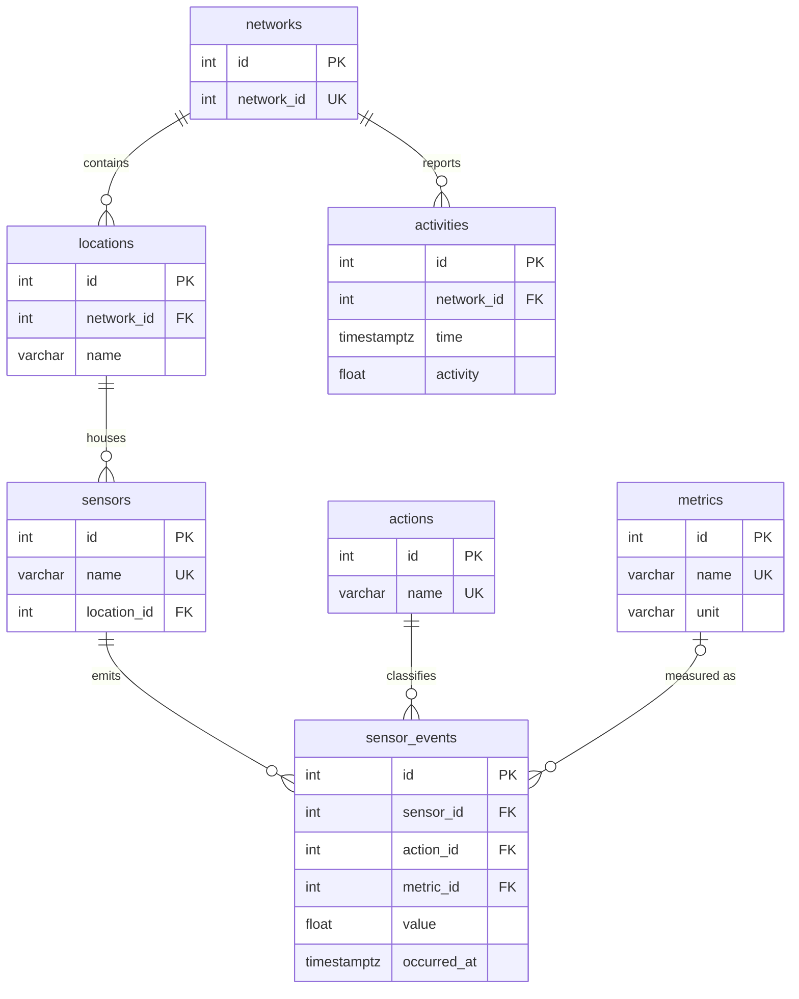
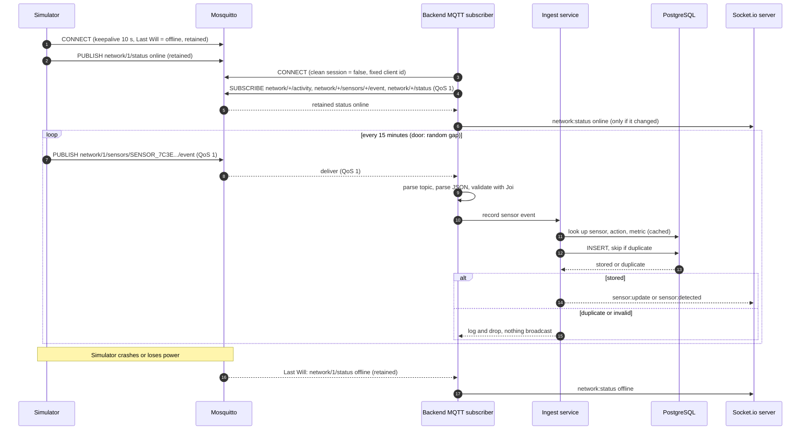
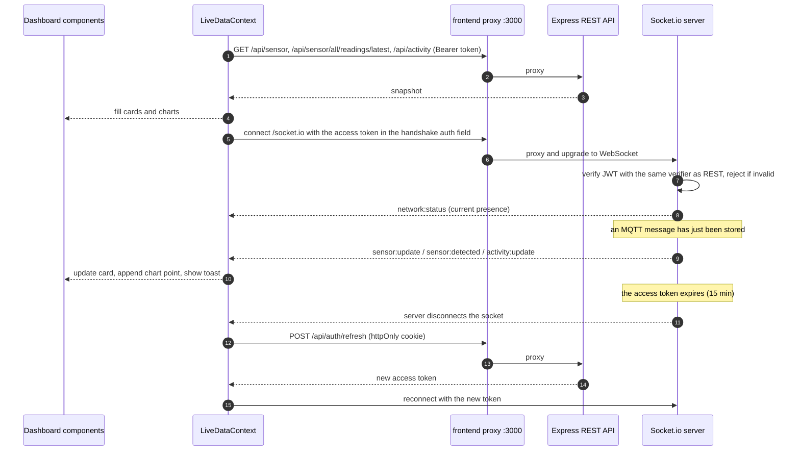
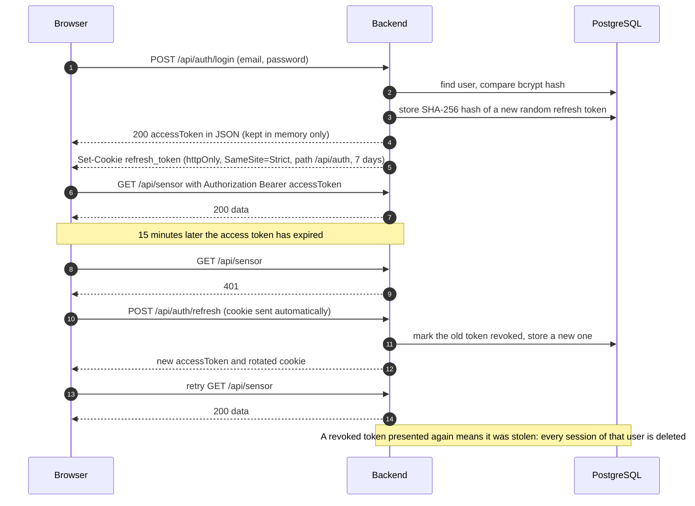

# HomePulse

**A real-time IoT sensor dashboard for the home.** Simulated devices publish readings over MQTT, a Node.js backend validates and stores every reading in PostgreSQL, and a React dashboard shows them live over Socket.io, with charts of the history.

```
simulator ──MQTT──▶ Mosquitto ──MQTT──▶ backend ──Socket.io──▶ browser
                                           │  ◀──REST (JWT)───
                                           ▼
                                       PostgreSQL
```

Everything runs with one command: `docker compose up`.

---

## Contents

- [Tech stack](#tech-stack)
- [Quick start](#quick-start)
- [Features](#features)
- [How it works](#how-it-works)
  - [System architecture](#system-architecture)
  - [Database](#database)
  - [Simulator → MQTT broker → backend](#simulator--mqtt-broker--backend)
  - [Real-time updates: backend → browser](#real-time-updates-backend--browser)
  - [Authentication](#authentication)
- [Socket.io events](#socketio-events)
- [Operations and troubleshooting](#operations-and-troubleshooting)

---

## Tech stack

The frontend, backend and simulator are all written in strict TypeScript.

| Layer | Technology | Why this choice |
|---|---|---|
| **Frontend** | React 18, Vite 6, TypeScript | Fast dev server and build, typed end to end |
| UI | MUI 9 with a custom light theme | Accessible components; every design token lives in `frontend/src/theme/` |
| Charts | Recharts 3 | Declarative React charts, enough for time series and bar charts |
| Server state | TanStack Query 5 | Caching, retries and loading/error states for REST calls |
| App state | React Context (`AuthContext`, `LiveDataContext`) | Two small pieces of global state don't need Redux |
| Routing | React Router 7 | Route guards for public vs. signed-in pages |
| Serving (Docker) | `vite preview` | Serves the build and reuses the dev proxy rules, so dev and Docker share one config. A demo choice: real traffic would get nginx |
| **Backend** | Node.js 22, Express 4, TypeScript | A small, well-known HTTP layer |
| Database access | Prisma 6 (raw SQL where Prisma cannot express it) | Typed queries and versioned migrations |
| Real-time | Socket.io 4.8 (server) + socket.io-client 4.8 (browser) | Push to authenticated browsers: the JWT travels in the handshake and the client reconnects on its own (see [why](#why-socketio)) |
| MQTT client | mqtt.js 5 | QoS 1, persistent sessions, automatic reconnect |
| Validation | Joi 18 | Every request body, query, path parameter, env variable and MQTT payload is validated |
| Auth | jsonwebtoken (HS256), bcryptjs (cost 12) | Short-lived access token plus a rotating refresh token |
| Logging | Winston | Readable output in development, JSON in production |
| **Database** | PostgreSQL 16 | Relational catalog plus time-series tables, with unique and CHECK constraints |
| **Message broker** | Eclipse Mosquitto 2 | Lightweight MQTT broker, the standard for IoT |
| **Simulator** | Node.js 22, mqtt.js, TypeScript | Acts as the home's devices, in its own container |
| **Delivery** | Docker Compose, multi-stage images, non-root containers | One command on a fresh clone |

---

## Quick start

### Prerequisites

- [Docker](https://docs.docker.com/get-docker/) with Docker Compose v2. Nothing else: no Node.js, no `.env` file, no `npm install`.
- Free ports **3000**, **4000**, **5432** and **1883**.

### Run it

```bash
git clone <repository-url> homepulse
cd homepulse
docker compose up
```

The first start builds three images (backend, simulator, frontend), creates the database, loads the sample data from `data/` and fills in the history between the end of that data and now. Allow a few minutes. The log ends with:

```
============================================================
  HomePulse is ready:  http://localhost:3000

  New here? Register first - the demo ships with sensor
  history already loaded, but no user accounts.
============================================================
```

1. Open **http://localhost:3000**.
2. Click **Register** and create an account. The database comes with sensor history already loaded, but no users.
3. You land on the dashboard. New readings arrive by themselves: a small notification in the corner each time it does.

### Stop, restart, reset

| Goal | Command |
|---|---|
| Stop (keeps all data) | `Ctrl-C`, or `docker compose down` |
| Start again | `docker compose up` (the seed is skipped because the data is already there) |
| Rebuild after changing code | `docker compose up --build` |
| Run in the background | `docker compose up -d`, then `docker compose logs -f` |
| **Wipe everything** (database, accounts, broker state) | `docker compose down -v` (the next `up` seeds from scratch) |

### See it working

```bash
# Kill the devices: the "Devices live" chip on the dashboard turns to "Devices offline" within seconds
docker compose kill simulator
docker compose start simulator
```

---

## Features

### Built

**Accounts and sessions**
- Register, sign in and sign out. The session survives a page reload, and the short-lived access token is renewed silently in the background.
- Only `/login` and `/register` are public. Every other page, every REST endpoint (except health and the auth routes) and the WebSocket require a signed-in user.

**Live dashboard**
- **Device presence chip**: *Devices live* or *Devices offline*, driven by MQTT presence (including the broker's Last Will).
- **Device list**: every sensor with its location and what it measures.
- **Four live cards** (front door, bathroom temperature and humidity, whole-home movement): the value in plain words, its age ("3 min ago"), and a stale warning when a feed goes quiet.
- **Live update toast** whenever a reading changes.

**Charts**
- **Movement through the day**: minutes of movement in each 15-minute period over the last 12 hours. New buckets are appended live as they arrive over the socket.
- **Sensor history**: temperature or humidity as bars coloured by comfort band, with the ideal range shaded behind them. You can pick the metric and move the 12-hour window to any point in the history.

**UI**
- Responsive layout from phone to desktop. Loading skeletons, empty states and error messages on every panel.
- Unknown URLs show a **Page not found** page with a link back to the dashboard. Like every other page it requires sign-in, so a signed-out visitor signs in first.
- Opening a protected page while signed out leads to the sign-in page, then **back to the page you asked for**. Opening `/login` or `/register` while signed in goes straight to the dashboard.

---

## How it works

### System architecture

Five containers on one Compose network. The browser only ever talks to the frontend container on port 3000, where `vite preview` serves the React build and acts as a **reverse proxy**, passing `/api` and `/socket.io` on to the backend. From the browser's point of view there is **one origin**, so no CORS or credential configuration is needed.



Solid arrows show who opens the connection or sends the request. Dotted arrows show messages pushed back over a connection the other side opened: the backend dials the broker and the broker pushes to it, and the browser dials the backend and the backend pushes to it.

The simulator runs as a container on the same network and reaches the broker as `mosquitto:1883`. In a real deployment the devices would connect to the broker from outside, over the internet.

| Service | Image | Role | Host port |
|---|---|---|---|
| `postgres` | `postgres:16-alpine` | Stores users, sessions, the device catalog and all readings | 5432 |
| `mosquitto` | `eclipse-mosquitto:2` | MQTT broker between devices and backend | 1883 |
| `backend` | built from `backend/` | REST API, MQTT subscriber and ingestion, Socket.io server | 4000 |
| `simulator` | built from `simulator/` | Pretends to be the home's devices and publishes over MQTT | – |
| `frontend` | built from `frontend/` | `vite preview`: serves the React build and proxies API and socket traffic to the backend | 3000 |

The backend is layered: `routes/` declare paths and middleware, `handlers/` translate HTTP (status codes, cookies), and `services/` hold business logic and database access without touching Express. The MQTT ingestion path (`mqtt/`) reuses the same services, and the Socket.io layer (`realtime/`) only broadcasts what the services report as stored.

### Database

Nine tables in third normal form. The device catalog (network → location → sensor) is relational. Readings are stored as a `metric_id` plus a numeric `value` rather than as JSON, so they can be indexed, range-checked and aggregated.

**Two independent areas.** `users` and `refresh_tokens` hold accounts. The other seven tables hold the home's data.

**Accounts:**



**The home's data:**



**No link between users and networks, on purpose.** For this demo there is no relation between `users` and `networks`, so every signed-in user can see the dashboard.

**Constraints that carry weight:**

| Constraint | Purpose |
|---|---|
| `sensor_events` unique on `(sensor_id, metric_id, occurred_at)` with `NULLS NOT DISTINCT` | Makes ingestion idempotent. A redelivered MQTT message is a no-op, and door events (no metric) are de-duplicated too, which a plain unique index would miss because it treats NULLs as distinct |
| `sensor_events` CHECK `(metric_id IS NULL) = (value IS NULL)` | A reading is either complete (metric and value) or a pure event (neither) |
| `activities` unique on `(network_id, time)` | One bucket per network per quarter-hour. Duplicates are ignored |
| `activities` CHECK `activity BETWEEN 0 AND 15` | A 15-minute bucket cannot hold more than 15 minutes of motion, even if a bug or a manual write tries |
| `sensors`, `metrics`, `actions` are reference data | MQTT messages can only *refer* to existing rows, never create them, so a misbehaving device cannot fill the catalog with junk |
| `networks.id` vs `networks.network_id` | A surrogate primary key, separate from the external id that devices and data files use |

Prisma's schema language cannot express `NULLS NOT DISTINCT` or CHECK constraints, so those two lines are hand-written SQL inside the Prisma-generated migrations in `backend/prisma/migrations/`.

**Sample data.** `data/sensors.json` has 49,267 events from two devices: a bathroom temperature/humidity sensor and a front-door vibration sensor. `data/activity.json` has 28,777 fifteen-minute activity buckets. Both span 2025-10-01 to 2026-07-27. On every start the backfill fills the gap from the end of that data to the present, with values in the same ranges, so the charts have continuous history on a fresh clone.

### Simulator → MQTT broker → backend

The **simulator** is a separate container that acts as the home's devices. It holds one MQTT connection and publishes three kinds of message. The **backend** subscribes with wildcards, validates each message, stores it, and only then tells the browsers.

#### Topics and payloads

| Topic | Payload example | QoS / retained | When |
|---|---|---|---|
| `network/1/activity` | `{"time":"2026-09-21T10:15:00.000Z","activity":5.14}` | 1 / no | At every real quarter-hour, for the bucket that just ended, plus one at start-up |
| `network/1/sensors/SENSOR_7C3E822F6E550000/event` | `{"action":"SensorValueChanged","payload":{"unit":"C","temperature":24.4},"occurredAt":"…"}` | 1 / no | Bathroom: one temperature and one humidity message every 15 min |
| `network/1/sensors/SENSOR_282C02BFFFEEE739/event` | `{"action":"SensorDetected","payload":{},"occurredAt":"…"}` | 1 / no | Front door: after a random 1 to 30 minute gap |
| `network/1/status` | `{"status":"online"}` or `{"status":"offline"}` | 1 / **retained** | `online` on every connect, `offline` on graceful shutdown, or `offline` published **by the broker** (Last Will) if the simulator dies |

Values are random within the ranges seen in the sample data (temperature 18.8 to 28.7 °C, humidity 21 to 89 %, activity 0 to 14.83 min). Timestamps come from the real clock.

#### Message lifecycle



**What the backend does with each message** (`backend/src/mqtt/`):

1. **Route by topic.** Strict patterns (network id of up to 9 digits, sensor name `[A-Za-z0-9_-]{1,64}`). Anything else is logged and ignored.
2. **Parse and validate.** The body must be JSON matching a Joi schema. MQTT payloads are untrusted input, so a bad message is logged and dropped and can never crash the subscriber.
3. **Resolve references.** Sensor, action and metric names become ids through cached lookups. A message is dropped with a warning if the sensor is unknown, belongs to a different network than the topic, or sends an unknown action or metric, or a unit that doesn't match the metric's.
4. **Store idempotently.** `createMany({ skipDuplicates: true })` on the unique keys, so the result is `stored` or `duplicate`.
5. **Broadcast only what was stored.** A duplicate or a dropped message tells the browser nothing new.

Presence (`network/+/status`) is not stored in the database. The backend keeps it in memory and broadcasts only real changes, because the broker replays the retained message on every resubscribe.

#### Failure behaviour

| Situation | What happens |
|---|---|
| Backend restarts or is down | The broker keeps the backend's persistent session (`clean: false`) and queues QoS 1 messages, which are delivered on reconnect. Unique keys make any redelivery harmless |
| Simulator crashes, is killed, or its network drops | The broker publishes the retained Last Will `offline` (at once for a closed connection, within about 15 s for a silent one via the 10 s keepalive). The dashboard chip turns red |
| Simulator stops gracefully | It publishes `offline` itself, since a clean disconnect makes the broker discard the will |
| Broker restarts | Mosquitto persistence keeps retained status and queued messages, and both clients reconnect every 2 s |
| Invalid, unknown or duplicate message | Logged and dropped. Nothing is stored or broadcast |

### Real-time updates: backend → browser

The dashboard combines two sources, each with one job:

- **REST gives the snapshot.** On load, three queries (`/api/sensor`, `/api/sensor/all/readings/latest`, `/api/activity`) fill every card and chart at once, so nothing waits 15 minutes for the next reading.
- **Socket.io gives the deltas.** After that, only socket events change the live values. The socket is **push-only**: the browser never emits, and every write goes over REST.

All live values have a single owner, `LiveDataContext`. Each value is filled once from the snapshot and then moved only by socket events, so there is no merging and no timestamp comparison.



Key properties:

- **Authenticated before a socket exists.** The access token travels in the Socket.io handshake (`io({ auth: { token } })`), not in the URL, so it never lands in proxy logs or browser history.
- **A socket cannot outlive its token.** The server disconnects each socket when its token expires, so a logged-out or revoked session leaves the feed within 15 minutes. The client refreshes and reconnects automatically. Refresh calls are de-duplicated, so the socket and a REST call can never replay the single-use refresh token at the same moment.
- **Nothing unconfirmed.** Events are emitted only after the row is stored. When the connection drops, the presence chip goes back to "Checking devices" instead of showing a status nobody is keeping up to date.
- **The frontend proxy** passes the WebSocket upgrade through (`ws: true` in `vite.config.ts`, used by both the dev server and `vite preview`).

<a id="why-socketio"></a>
**Why Socket.io and not SSE, raw WebSocket or polling?** Everything live in this app flows server → client, so on shape alone Server-Sent Events would fit. What decided it was **authentication**. The access token is a Bearer token held only in memory, and neither `EventSource` nor the browser `WebSocket` API can set an `Authorization` header. The only ways around that are a token in the query string (logged everywhere), a cookie-based access token (reverses a security decision), or a separate ticket endpoint. Socket.io's handshake carries the token natively and reuses the REST verifier, and it brings reconnect with backoff and jitter, heartbeats and named events, which would otherwise be about 200 lines of untested code. Polling would work at this message rate (about 16 messages an hour), but it cannot report connection state and couples latency to cost. A front-door alert needs push.

### Authentication



- **Access token:** HS256 JWT, 15 minutes, sent as `Authorization: Bearer`. It is kept in a JavaScript variable only, never in `localStorage`, so XSS cannot steal a long-lived credential.
- **Refresh token:** 32 random bytes, single use, rotated on every refresh. It lives in an httpOnly cookie that JavaScript cannot read, and the database stores only its SHA-256 hash. **Reuse detection:** presenting an already-rotated token revokes all of that user's sessions immediately.
- **Page reload:** the app calls `/api/auth/refresh` on start-up to restore the session from the cookie.
- **Logout** deletes the token row and clears the cookie.

---

## Socket.io events

Path `/socket.io`, same origin as the app. Connect with `io({ auth: { token: accessToken } })`. A missing or invalid token is rejected with `connect_error: unauthorized`. The server only emits, and the client sends nothing.

| Event | Payload | Emitted when |
|---|---|---|
| `sensor:update` | `{ networkId, sensorName, metricName, unit, value, occurredAt }` | A temperature or humidity reading has been stored |
| `sensor:detected` | `{ networkId, sensorName, occurredAt }` | A door detection has been stored |
| `activity:update` | `{ networkId, time, activity }` | A 15-minute activity bucket has been stored |
| `network:status` | `{ networkId, status: "online" \| "offline", changedAt }` | Right after connecting (the current state), and whenever device presence changes |

Timestamps are ISO 8601 strings. The event maps are typed on both sides (`backend/src/realtime/events.ts`, `frontend/src/realtime/events.ts`).

---

## Operations and troubleshooting

### Health and logs

| Check | Command |
|---|---|
| Container health | `docker compose ps` (every service shows `healthy`) |
| API liveness | `curl http://localhost:4000/api/health` |
| All logs | `docker compose logs -f` |

The backend logs readable text in development and JSON in production (`NODE_ENV=production`, as in Compose), ready for a log aggregator.

### Common issues

| Symptom | Cause and fix |
|---|---|
| `port is already allocated` | Another program is using that port. Stop it, or move HomePulse with `FRONTEND_PORT`, `BACKEND_PORT`, `POSTGRES_PORT` or `MQTT_PORT` (for example `FRONTEND_PORT=3001 docker compose up`) |
| The dashboard shows "Checking devices" for a moment | Normal after connecting or reconnecting (for example at each 15-minute token renewal). It turns into "Devices live" as soon as the server sends the current presence |
| "Devices offline" | The simulator is not running: `docker compose ps simulator`, then `docker compose start simulator` |
| A card shows a stale warning | That feed has not reported within its normal rhythm. Check the simulator and the `backend` log for `Dropped` lines |
| `Ignored duplicate activity` in the log at every start | Expected. The backfill and the simulator both write the last finished bucket at start-up, and the unique key keeps only one. This overlap guarantees no bucket is lost during the handover |
| Signed out after about 15 minutes | The refresh cookie is not coming back. It is marked `Secure` whenever `COOKIE_SECURE=true`, which requires HTTPS |
| Want a clean slate | `docker compose down -v && docker compose up` |
